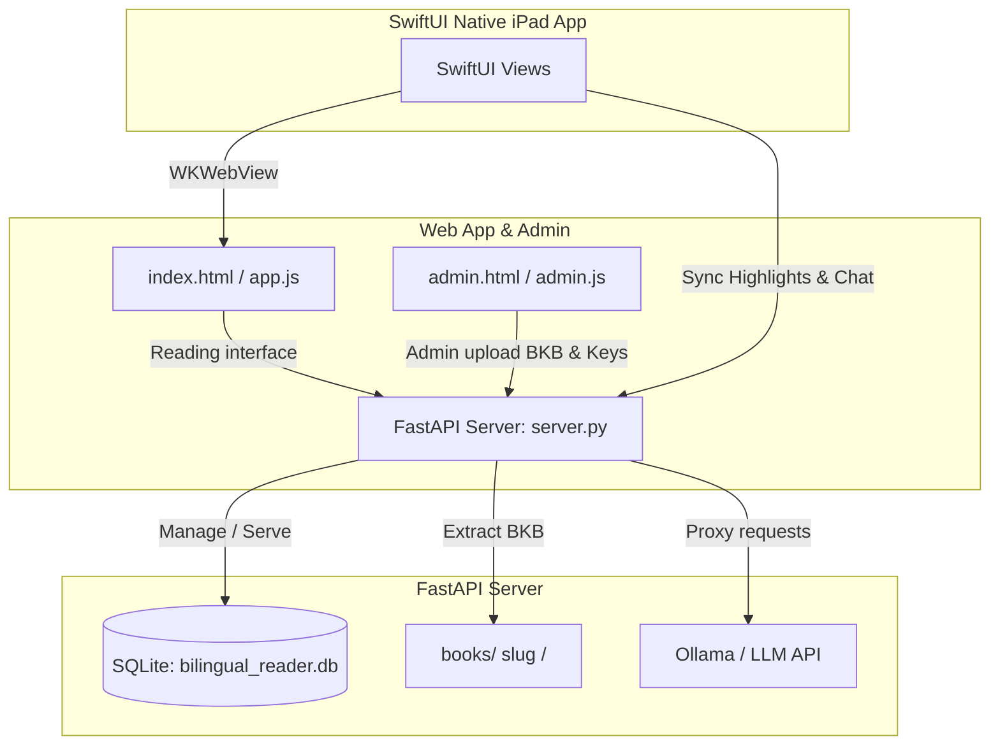

# Bilingual Digital Library & Reader System (bilingual-app)

Trải nghiệm đọc sách song ngữ (Anh - Việt) cao cấp kết hợp với Trợ lý học tập thông minh AI. Đây là hệ thống độc lập chịu trách nhiệm **tiêu thụ (consume)** và hiển thị các gói sách định dạng `.bkb` được đóng gói từ hệ thống biên soạn sách.

---

## 🏛️ Kiến trúc Hệ thống (System Architecture)

Hệ thống được chia làm 3 cấu phần chính:



### 1. Web Frontend (Library & Reader App)
- **Library (`application/legacy/web-app-v1/index.html`, `application/legacy/web-app-v1/app.js`)**: Trang chủ chứa tủ sách công cộng. Hiển thị sách được tải lên, tìm kiếm, lưu tiến trình đọc tự động.
- **Reader (Side-by-Side Split View)**: Hiển thị song song bản gốc tiếng Anh và bản dịch tiếng Việt chuẩn A4. Đồng bộ cuộn (scroll sync) mượt mà cho cả 2 ngôn ngữ.
- **Admin Portal (`application/legacy/web-app-v1/admin.html`, `application/legacy/web-app-v1/admin.js`)**: Giao diện kéo thả file `.bkb`, tự động giải nén và nạp sách vào DB, cấp quyền cho user, tạo API Key và quản lý thành viên.

### 2. Backend Server (FastAPI)
- **Tập tin chạy**: `server.py` (Chạy trình bao tự động định tuyến môi trường ảo `.venv`).
- **Logic cốt lõi (`application/backend/api`)**:
  - **Auth**: Đăng ký, đăng nhập sử dụng cơ chế JWT Access Token + Refresh Token (HTTP-Only Cookie / Bearer Header) để hạn chế phải đăng nhập lại.
  - **Book Ingest**: API `@app.post("/api/books/upload")` nhận file `.bkb`, tự động unpack bằng thư viện zip, ghi thông tin sách vào database và di chuyển thư mục sách vào `books/`.
  - **Secure Serve**: Chặn truy cập tĩnh vào thư mục `books/*` nếu người dùng chưa có quyền (`UserPermission`).
  - **AI Chat Proxy**: Ủy nhiệm request chat đến Ollama/LLM API từ cổng an toàn `/api/chat` để tránh lỗi CORS.
  - **Voca API Proxy**: Ủy nhiệm tra từ / tạo thẻ / audio / practice đến dịch vụ Voca qua `/api/voca/*`, đính kèm origin + API key lấy từ cấu hình lưu server-side nên trình duyệt không bao giờ thấy khóa. Xem [Voca 2.0 integration](application/docs/voca-integration.md).

### 3. iOS SwiftUI App (`application/mobile_ios`)
- Ứng dụng gốc (Native Swift) viết hoàn toàn bằng SwiftUI được tối ưu hóa cho iPad và iPhone.
- **WebView Bridge (`BilingualWebView.swift`)**: Nhúng Web Reader và inject code JavaScript tùy biến qua `WKUserScript` để hỗ trợ chọn từ/câu, hiển thị highlight và đồng bộ hóa annotation.
- **Floating Panel & Color Picker**: Thanh công cụ ghi chú trực quan, chọn màu highlight tròn, lưu trực tiếp ghi chú/highlight lên DB server và đồng bộ lại Web Reader.
- **AI Assistant**: Sidebar trò chuyện dạng slide-in chuyên nghiệp (trên iPad) hoặc sheet modal (trên iPhone) đồng bộ trực tiếp câu hỏi dựa trên nội dung bạn vừa highlight.

---

## 🚀 Hướng dẫn khởi chạy (Launch Instructions)

### 1. Khởi chạy cục bộ (Local Launch)

**Chuẩn bị môi trường**:
Yêu cầu Python từ phiên bản **3.10** trở lên. Môi trường ảo `.venv` phải được khởi tạo bên trong thư mục `application/`.

Cài đặt các thư viện phụ thuộc:
```bash
cd application
rm -rf .venv
python3 -m venv .venv
source .venv/bin/activate
pip install -r backend/requirements-api.txt
pip install -e backend
```

**Khởi chạy Server**:
Để khởi động FastAPI Server chạy ngầm trên cổng `27099`, chạy file `server.py` ở thư mục gốc của dự án:
```bash
python3 server.py
```
*Lưu ý: Script `server.py` sẽ tự động phát hiện và kích hoạt môi trường ảo `.venv/` để đảm bảo hệ thống chạy chính xác.*

---

### 2. Triển khai trên máy chủ Debian (Server Deployment)

Ứng dụng hỗ trợ tập lệnh triển khai thông minh chạy dưới dạng Background Process (dịch vụ `systemd`) trên Debian/Ubuntu.

#### ⚡ Cài đặt từ GitHub Release — chỉ 1 lệnh (khuyến nghị)
Tải bản Release mới nhất (đã build sẵn frontend v2 — **không cần Node**), cấu hình Python + systemd và chạy dịch vụ trên cổng `27099`:
```bash
curl -sSL https://raw.githubusercontent.com/thaonv7995/bilingual-app/main/deploy.sh | bash -s -- install-release /opt/bilingual-app
```
Cập nhật lên bản Release mới hơn: chạy lại đúng lệnh trên. Gỡ cài đặt:
```bash
curl -sSL https://raw.githubusercontent.com/thaonv7995/bilingual-app/main/deploy.sh | bash -s -- delete /opt/bilingual-app
```

**Hỗ trợ OS** (script tự nhận diện trình quản lý gói):

| OS | Lệnh 1 dòng ở trên | Ghi chú |
| :--- | :---: | :--- |
| Debian / Ubuntu (`apt`) | ✅ | Mặc định, tự cài đủ dependency |
| Fedora / RHEL / CentOS (`dnf`/`yum`) | ✅ | Tự cài qua dnf/yum + NodeSource |
| Arch (`pacman`), openSUSE (`zypper`) | ✅ | Tự cài python/node qua pacman/zypper |
| **macOS / Windows** | ❌ | Không có `systemd` → chạy trực tiếp (mục **Local Launch** ở trên) hoặc dùng **WSL** / Docker |

> Yêu cầu chung: có `curl`, `tar`, và quyền `sudo` (để đăng ký systemd). Bản `install-release` **không cần Node** (đã build sẵn `dist/`); bản build-from-source cần Node ≥18 (script tự cài).

<details>
<summary>Phương án khác: build từ source (git clone)</summary>

Tự clone repo và **build v2 tại chỗ** (cần Node ≥18 — script tự cài) — dùng khi muốn code mới nhất trên `main` thay vì bản Release:
```bash
# Cài đặt
curl -sSL https://raw.githubusercontent.com/thaonv7995/bilingual-app/main/deploy.sh | bash -s -- install /opt/bilingual-app https://github.com/thaonv7995/bilingual-app.git
# Cập nhật (git pull + rebuild + restart)
curl -sSL https://raw.githubusercontent.com/thaonv7995/bilingual-app/main/deploy.sh | bash -s -- update /opt/bilingual-app
```
</details>

*Xem thêm tài liệu cấu hình CI/CD tự động bằng GitHub Actions tại [DEPLOYMENT.md](file:///Users/thaonv/Projects/Personal/bilingual-app/application/backend/docs/DEPLOYMENT.md).*

---

## 🗄️ Cấu trúc Cơ sở Dữ liệu (Database Schema)

Hệ thống sử dụng cơ sở dữ liệu SQLite (`bilingual_reader.db`) chứa các bảng sau:
1. `users`: Thông tin người dùng (`username`, `password_hash`, `is_admin`).
2. `books`: Quản lý danh sách sách (`slug`, `title`, `author`, `page_count`, `cover_path`, `is_published`).
3. `user_permissions`: Cấp quyền đọc sách cho từng user thường.
4. `api_keys`: Khóa API dành cho các service bên ngoài kết nối với thư viện.
5. `highlights`: Lưu trữ highlight của người dùng (`book_slug`, `page_number`, `element_id`, `color`, `note`, `selected_text`).
6. `reading_progress`: Tự động lưu trang hiện tại của người dùng khi đọc sách.
7. `user_refresh_tokens`: Lưu token refresh để luân chuyển khóa JWT an toàn.

---

## 🔑 Cơ chế Đăng nhập & API Keys

- **User Access Token**: Thời hạn ngắn (e.g. 15 phút), truyền qua header `Authorization: Bearer <token>` hoặc lưu trong cookie an toàn `jwt_token`.
- **Refresh Token**: Thời hạn dài (e.g. 7 ngày), lưu an toàn trong DB và tự động gửi qua cookie `refresh_token` để refresh Access Token tự động khi hết hạn.
- **API Key**: Cung cấp mã tĩnh `X-API-Key` cho các tool ngoài để tương tác tự động với API của thư viện (ví dụ như tự động đẩy sách sau khi build).
- **Voca API Key**: Khóa `voca_...` của dịch vụ Voca. Người dùng tự nhập trong Settings; web-v2 lưu server-side (`user_settings`), iOS lưu trên máy. Backend có thể đặt khóa mặc định qua env `VOCA_BRIDGE_TOKEN`.

### ⚠️ Bắt buộc: thu hồi (rotate) Voca API key đã lộ

Khóa Voca API từng bị hardcode trong `VocaService.swift` (và trong file legacy `legacy/web-app-v1/voca-client.js` mà backend phục vụ **công khai**) đã được commit vào repo này. Xóa nó khỏi HEAD **không** xóa nó khỏi lịch sử git — ai clone repo cũng đọc lại được.

Cần làm ngay: vào **Voca → Settings → API Keys**, thu hồi khóa cũ, tạo khóa mới, rồi nhập khóa mới ở màn hình Settings (iOS / web-v2) hoặc đặt vào `.env` trên server. Không commit khóa mới vào repo.
